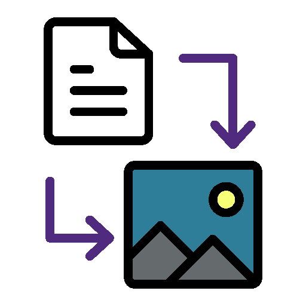

[![Contributors][contributors-shield]][contributors-url]
[![Forks][forks-shield]][forks-url]
[![Stargazers][stars-shield]][stars-url]
[![Issues][issues-shield]][issues-url]
[![MIT License][license-shield]][license-url]

<!-- PROJECT LOGO -->
 

  

  <h3 align="center">Web Image Converter</h3>

  
Convert WebP images to PNG or JPG with a simple GUI. 

  

<!-- TABLE OF CONTENTS -->

  
Table of Contents

  <ol>
    <li>
      <a href="#about-the-project">About The Project</a>
      <ul>
        <li><a href="#what-it-do">What This Application Does</a></li>
        <li><a href="#how-to-use">How to Use This Mod</a></li>
        <li><a href="#built-with">Built With</a></li>
      </ul>
    </li>
    <li>
      <a href="#getting-started">Getting Started</a>
      <ul>
        <li><a href="#prerequisites">Prerequisites</a></li>
        <li><a href="#setup">Setup</a></li>
        <li><a href="#build">Build</a></li>
        <li><a href="#publish">Publish</a></li>
      </ul>
    </li>
    <li><a href="#roadmap">Roadmap</a></li>
    <li><a href="#contributing">Contributing</a></li>
    <li><a href="#license">License</a></li>
  </ol>

<!-- ABOUT THE PROJECT -->
## About The Project
Yada-yada-yada...

### Items Added
Yada-yada-yada...

(<a href="#readme-top">back to top</a>)

### Mod Variations
Yada-yada-yada...

(<a href="#readme-top">back to top</a>)

### Built With
| Frameworks/Libraries                                      | Name         | Link                                       |
| :-------------------------------------------------------: | :----------: | :----------------------------------------: |
|               | `C Sharp`    | [C# Documentation][CSharp-url]             |

|                         IDEs                                |      Name       | Link                                      |
| :---------------------------------------------------------: | :-------------: | :---------------------------------------: |
|  | `Visual Studio` | [Visual Studio Website][VisualStudio-url] |
|        | `VSCode`        | [VSCode Website][Vscode-url]              |

(<a href="#readme-top">back to top</a>)

<!-- GETTING STARTED -->
## Getting Started
Yada-yada-yada...

### Prerequisites
This will list the minimum requirements to modify, build, and publish this application:
  1. Visual Studio Community 2022
  2. .NET 8 or .NET 9 SDK
  3. Six Labors ImageSharp NuGet package.

### Setup
Yada-yada-yada...

### Build
Yada-yada-yada...

### Publish
Yada-yada-yada...

(<a href="#readme-top">back to top</a>)

<!-- ROADMAP -->
## Roadmap
- [x] Nothing in the works yet.

Suggest changes or report issues [here](https://github.com/jbs4bmx/WebImageConverter/issues).

(<a href="#readme-top">back to top</a>)

<!-- CONTRIBUTING -->
## Contributing
Contributions are what make the open source community such an amazing place to learn, inspire, and create. Any contributions you make are **greatly appreciated**.

If you have a suggestion that would make this better, please fork the repo and create a pull request. You can also simply open an issue with the tag "enhancement".
Don't forget to give the project a star! Thanks again!

1. Fork the Project
2. Create your Feature Branch (`git checkout -b feature/AmazingFeature`)
3. Commit your Changes (`git commit -m 'Add some AmazingFeature'`)
4. Push to the Branch (`git push origin feature/AmazingFeature`)
5. Open a Pull Request

You can also buy me a coffee! (This is not required, but I greatly appreciate any support provided.) 

(<a href="#readme-top">back to top</a>)

<!-- LICENSE -->
## License
Distributed under the MIT License. See `LICENSE` file for more information.

(<a href="#readme-top">back to top</a>)

<!-- Repository Metrics -->
[contributors-shield]: https://img.shields.io/github/contributors/jbs4bmx/WebImageConverter.svg?style=for-the-badge
[contributors-url]: https://github.com/jbs4bmx/WebImageConverter/graphs/contributors
[forks-shield]: https://img.shields.io/github/forks/jbs4bmx/WebImageConverter.svg?style=for-the-badge
[forks-url]: https://github.com/jbs4bmx/WebImageConverter/network/members
[stars-shield]: https://img.shields.io/github/stars/jbs4bmx/WebImageConverter.svg?style=for-the-badge
[stars-url]: https://github.com/jbs4bmx/WebImageConverter/stargazers
[issues-shield]: https://img.shields.io/github/issues/jbs4bmx/WebImageConverter.svg?style=for-the-badge
[issues-url]: https://github.com/jbs4bmx/WebImageConverter/issues
[license-shield]: https://img.shields.io/github/license/jbs4bmx/WebImageConverter.svg?style=for-the-badge
[license-url]: https://github.com/jbs4bmx/WebImageConverter/blob/master/LICENSE.txt

<!-- Framwork/Library URLs -->
[CSharp-url]: https://learn.microsoft.com/en-us/dotnet/csharp/
[VisualStudio-url]: https://visualstudio.microsoft.com/
[Vscode-url]: https://code.visualstudio.com/
