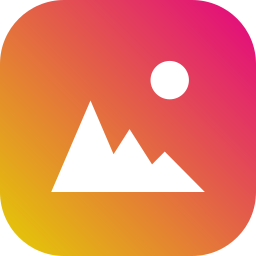

<a id="readme-top"></a>
[![Contributors][contributors-shield]][contributors-url]
[![Forks][forks-shield]][forks-url]
[![Stargazers][stars-shield]][stars-url]
[![Issues][issues-shield]][issues-url]
[![MIT License][license-shield]][license-url]

<!-- PROJECT LOGO -->
<br />
<div align="center">
  <a href="https://github.com/jbs4bmx/WebImageConverter">
    
  </a>

  <h3 align="center">Web Image Converter</h3>

  <p align="center">Convert WebP images to PNG or JPG with a simple GUI.<br /></p>

  [](https://ko-fi.com/X8X611JH15)
</div>


<!-- TABLE OF CONTENTS -->
<details>
  <summary>Table of Contents</summary>
  <ol>
    <li>
      <a href="#about-the-project">About The Project</a>
      <ul>
        <li><a href="#how-to-use">How to Use This Application</a></li>
        <li><a href="#built-with">Built With</a></li>
      </ul>
    </li>
    <li>
      <a href="#getting-started">Development</a>
      <ul>
        <li><a href="#prerequisites">Prerequisites</a></li>
        <li><a href="#setup">Setup</a></li>
        <li><a href="#build">Build</a></li>
        <li><a href="#publish">Publish</a></li>
      </ul>
    </li>
    <li><a href="#roadmap">Roadmap</a></li>
    <li><a href="#contributing">Contributing</a></li>
    <li><a href="#license">License</a></li>
  </ol>
</details>


<!-- ABOUT THE PROJECT -->
## About The Project
Web Image Converter is a simple, portable utility that converts images in WEBP format to JPG or PNG.

### How to Use This Application
  1. Double-click the application to run it.
  2. Select the folder that contains the webp images that you want to convert.
  3. Select the file type you want to convert the images to. Your options are JPG or PNG.
  4. Click the button to convert the images.

Converted images will be in the same folder as the webp images.

### Built With
|               Frameworks/Libraries                |     Name     |                 Link                 |
| :-----------------------------------------------: | :----------: | :----------------------------------: |
|          | `C Sharp`    | [C# Documentation][CSharp-url]       |
|      | `.NET`       | [.NET Website][dotNet-url]           |
|  | `ImageSharp` | [ImageSharp Website][ImageSharp-url] |

|                         IDEs                             |      Name       |                   Link                    |
| :------------------------------------------------------: | :-------------: | :---------------------------------------: |
|  | `Visual Studio` | [Visual Studio Website][VisualStudio-url] |
|        | `VSCode`        | [VSCode Website][Vscode-url]              |

<p align="right">(<a href="#readme-top">back to top</a>)</p>


<!-- DEVELOPMENT -->
## Development
🧑‍💻 How to Download, Open, Build, and Publish the WebImageConverter Project

### ✅ Prerequisites
Before getting started, install the following tools:
  1. Install .NET SDK. You’ll need one of the following:
     - .NET SDK 8.0 (LTS)
     - .NET SDK 9.0 (Preview) (optional)

     After installation, verify your SDK with:
     ```bash
     dotnet --version
     ```
  2. Install Visual Studio Community 2022. Download from: 👉 [Visual Studio Community 2022](https://visualstudio.microsoft.com/vs/community/)

     During installation:
     * ✅ Select the "Desktop development with .NET" workload
     * ✅ Confirm that .NET 8 is included in the components list

### 📦 Download the Project Files
You can obtain the source code using one of two methods:

#### Option A: Clone via Git (Recommended)
```bash
git clone https://github.com/your-username/WebImageConverter.git
cd WebImageConverter
```
Replace `your-username` with the actual GitHub username or organization.

#### Option B: Download as ZIP
  1. Go to the project’s GitHub page
  2. Click the green Code button
  3. Choose Download ZIP
  4. Extract the folder to a local directory (e.g. `C:\Projects\WebImageConverter`)

#### 🛠️ Open the Project in Visual Studio
Launch Visual Studio 2022
Click Open a project or solution
Navigate to the project folder
Select the `.sln` file (e.g. `WebImageConverter.sln`)
Click Open

### 📦 Install the ImageSharp NuGet Package

#### Option A: Via Package Manager Console
  1. Go to Tools → NuGet Package Manager → Package Manager Console
  2. Run:
      ``` powershell
      Install-Package SixLabors.ImageSharp
      ```

#### Option B: Via NuGet UI
  1. Right-click your project in Solution Explorer
  2. Click Manage NuGet Packages
  3. Go to the Browse tab
  4. Search for `SixLabors.ImageSharp`
  5. Click Install

### 🔧 Build the Project
To build the solution:
  1. Press `Ctrl + Shift + B` or go to **Build → Build Solution**

If successful, the compiled `.exe` will appear in:
```
bin\Release\net8.0-windows\
```

### 🚀 Publish as a Single-File Executable
This creates a portable .exe that includes:
  * ✅ Your app logic and resources
  * ✅ All dependencies (like ImageSharp)
  * ✅ The .NET runtime (no installation required)

Steps:
  1. Right-click your project → **Publish**
  2. Choose **Folder** as the target
  3. Click **Edit** on the publish profile

Set the following options:
  * Deployment mode: `Self-contained`
  * Target runtime: `win-x64`
  * File options:
    - ✅ Produce single file
    - ❌ Disable trimming unless you're trimming-safe

Save and click **Publish** </br>
Your output **EXE** will appear in:
```
bin\Release\net8.0-windows\publish\
```

### 🧪 Verifying the Build
After publishing:
  * 🖱️ Right-click the `.exe` **→ Properties → Details**
  * Confirm the icon, version number, and metadata (if configured)
  * Double-click to launch the app and test WebP conversion

<p align="right">(<a href="#readme-top">back to top</a>)</p>


<!-- ROADMAP -->
## Roadmap
- [x] Nothing in the works yet.

Suggest changes or report issues [here](https://github.com/jbs4bmx/WebImageConverter/issues).

<p align="right">(<a href="#readme-top">back to top</a>)</p>


<!-- CONTRIBUTING -->
## Contributing
Contributions are what make the open source community such an amazing place to learn, inspire, and create. Any contributions you make are **greatly appreciated**.

If you have a suggestion that would make this better, please fork the repo and create a pull request. You can also simply open an issue with the tag "enhancement".
Don't forget to give the project a star! Thanks again!

1. Fork the Project
2. Create your Feature Branch (`git checkout -b feature/AmazingFeature`)
3. Commit your Changes (`git commit -m 'Add some AmazingFeature'`)
4. Push to the Branch (`git push origin feature/AmazingFeature`)
5. Open a Pull Request

You can also buy me a coffee! (This is not required, but I greatly appreciate any support provided.)</br>
[](https://ko-fi.com/X8X611JH15)

<p align="right">(<a href="#readme-top">back to top</a>)</p>


<!-- LICENSE -->
## License
Distributed under the MIT License. See `LICENSE` file for more information.

<p align="right">(<a href="#readme-top">back to top</a>)</p>


<!-- Repository Metrics -->
[contributors-shield]: https://img.shields.io/github/contributors/jbs4bmx/WebImageConverter.svg?style=for-the-badge
[contributors-url]: https://github.com/jbs4bmx/WebImageConverter/graphs/contributors
[forks-shield]: https://img.shields.io/github/forks/jbs4bmx/WebImageConverter.svg?style=for-the-badge
[forks-url]: https://github.com/jbs4bmx/WebImageConverter/network/members
[stars-shield]: https://img.shields.io/github/stars/jbs4bmx/WebImageConverter.svg?style=for-the-badge
[stars-url]: https://github.com/jbs4bmx/WebImageConverter/stargazers
[issues-shield]: https://img.shields.io/github/issues/jbs4bmx/WebImageConverter.svg?style=for-the-badge
[issues-url]: https://github.com/jbs4bmx/WebImageConverter/issues
[license-shield]: https://img.shields.io/github/license/jbs4bmx/WebImageConverter.svg?style=for-the-badge
[license-url]: https://github.com/jbs4bmx/WebImageConverter/blob/master/LICENSE.txt

<!-- Framwork/Library URLs -->
[CSharp-url]: https://learn.microsoft.com/en-us/dotnet/csharp/
[VisualStudio-url]: https://visualstudio.microsoft.com/
[Vscode-url]: https://code.visualstudio.com/
[dotNet-url]: https://dotnet.microsoft.com/en-us/
[ImageSharp-url]: https://sixlabors.com/products/imagesharp/
